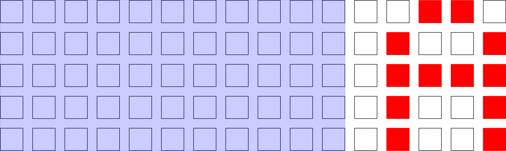
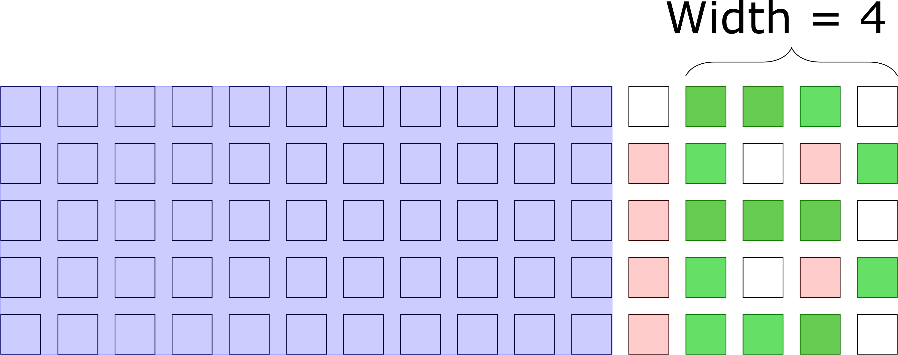
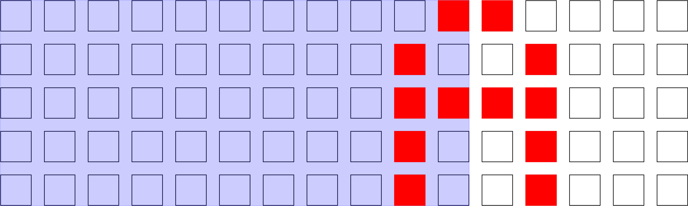
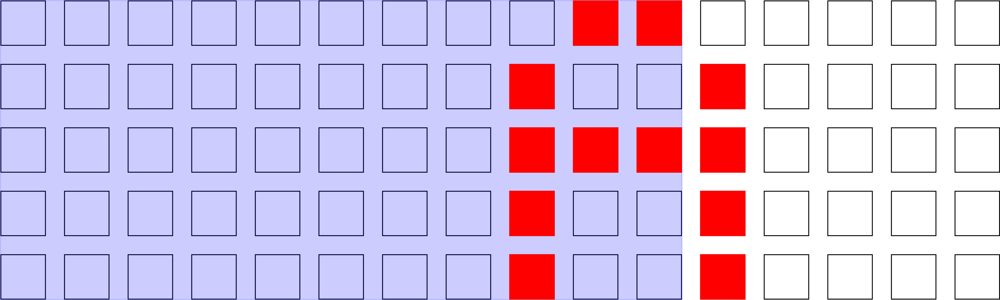
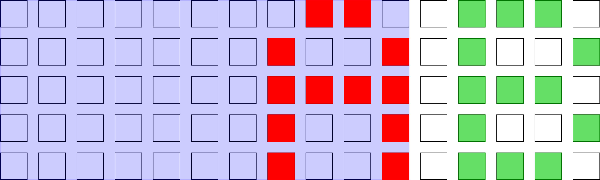

#LED-Matrix 5x11

LED-Matrix 5x11 is a driver tailored to fit the purposes of
a custom-build 5x11 LED-Matrix. The Matrix is multiplexed via
two HC595-Shift registers.

Text is displayed pictured in the following sheme:

## Initial Situation

## Calculate the width of the letter to insert

## Empty the space for the next letter

## Insert the new letter:
